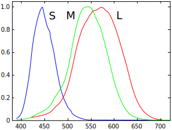
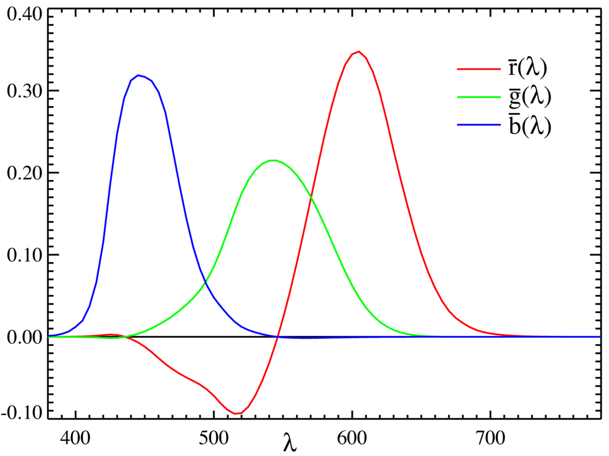
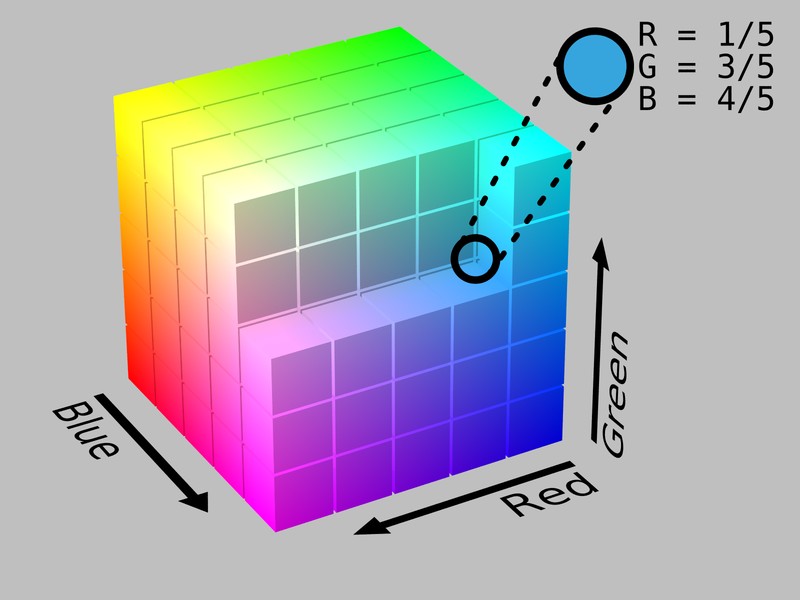
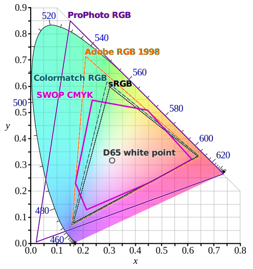
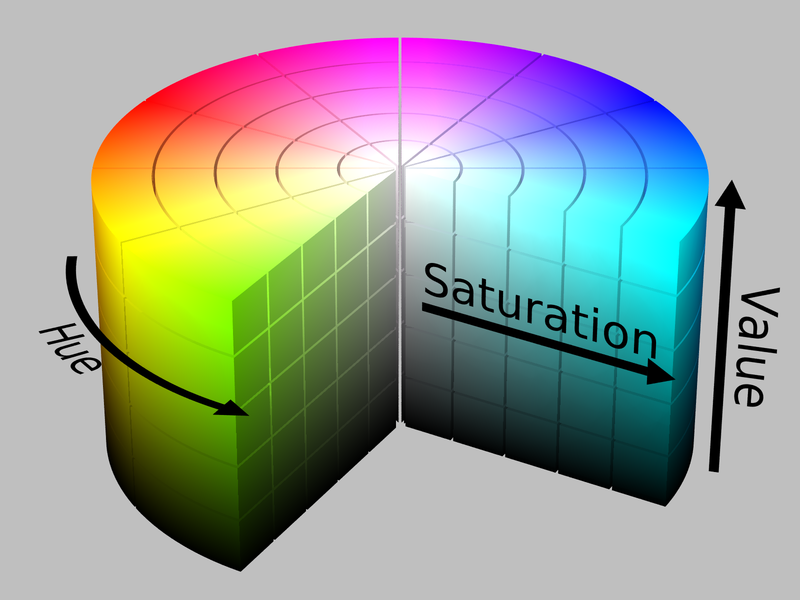

# 色彩空间

**前言**：关于色彩空间的问题其实困扰了我很久，一直不是很清楚，看了文章也很困惑，就算明白了也不能通过言语讲述出来。

同时也有一些其他的参考资料，放在下边：

> 参考阅读：
>
> - [色彩空间基础 - 知乎](https://zhuanlan.zhihu.com/p/24214731)
> - [Color space - Wikipedia](https://en.wikipedia.org/wiki/Color_space)
> - [Jeffrey Friedl's Blog » Digital-Image Color Spaces, Table of Contents (regex.info)](http://regex.info/blog/photo-tech/color-spaces-page0)
> - [Introduction to color space - Khan Academy](https://www.khanacademy.org/computing/pixar/color/color-space/v/color6-final)

## 色彩

什么是颜色或色彩呢？颜色，是对于视觉感知的特征描述，通常采用诸如红、橙、黄、绿、蓝、紫等之类的名字。这种感知来自于人等动物的视觉感知细胞受到电磁波的刺激（对于人来说也就是处在**可见光**波段的电磁波）。而一个物体的色彩则取决于它反射出的光的波长和强度，而这则由物体的物理特性，如同吸收和发射光谱有关。

## 色彩空间

色彩空间（color space）是一些颜色的特定组合，它以数字或者模拟的方式、以可以重现的方式来表示色彩。有的色彩空间很专横，只选择几个颜色并将其命名（比如可以规定某种颜色为“1号红”，某种颜色为“2号绿”等等），也可以从严谨的数学角度来进行建构。

**色彩模型**（color model）是抽象的数学模型，用一组数字来表示不同的色彩，通过定义色彩模型和**参考色彩空间**（reference color space）之间的映射关系（mapping function），就定义了一个色彩空间，比如Adobe RGB和sRGB都基于RGB色彩模型（其使用三元组表示一个色彩），但是它们是完全不同的两个色彩空间。

在定义一个色彩空间时，通常选择[CIELAB](https://en.wikipedia.org/wiki/CIELAB)或者[CIEXYZ](https://en.wikipedia.org/wiki/CIE_1931_color_space)色彩空间作为参考色彩空间，这两个色彩空间通过精巧的设计，几乎可以涵盖普通人能看到的所有颜色。

由于“**色彩空间**”一词确立了一组特定的**色彩模型**和**映射关系**的组合，有些时候会被误用来称呼某种色彩模型。比如，有很多色彩空间都是基于RGB色彩模型，但是**并没有所谓的RGB色彩空间**。

简单地说，通过定义色彩空间，我们就能够通过坐标从数值角度标识出现实世界中的颜色。

### CIE 1931 Color Spaces

CIE 1931色彩空间最早定义了**人眼可见色彩**与电磁波**可见光波段的波长分布**之间的量化关系，它由国际照明委员会（CIE，*Commission Internationale de l'éclairage*）于1931年创立。定义了这些色彩空间的数学关系是**色彩管理**（color management）中非常重要的工具，而色彩管理在诸如彩色喷墨、显示器显色、数字相机等记录设备中非常重要。

一般人眼中的有三种可以感知光的视锥细胞（cone cells），其感知的峰值分别落在短波段（short wavelengths，420nm - 440nm）、中波段（middle wavelengths，530 nm - 540 nm）、长波段（long wavelengths，560 nm - 580nm），分别记作"S"、"M"、"L"。视锥细胞使得人在中高光强下能够感知色彩；在暗光条件下，人的色觉会被削弱，这时，只能感受单色、但是对暗光敏感的视杆细胞（rod cells）就变得非常有用。

这样一来，理论上，使用三个参数来表示三种视锥细胞受刺激的程度，就能够表示出人的任何色觉。

> 以下包含转述自[色彩空间基础 - 知乎专栏](https://zhuanlan.zhihu.com/p/24214731)的内容，点击阅读详细内容。
>
> 也可以阅读维基百科相关内容：[CIE 1931 color space: Definition of the CIE XYZ colorspace: **CIE RGB color space** - Wikipedia](https://en.wikipedia.org/wiki/CIE_1931_color_space#CIE_RGB_color_space)

这里需要补充一下格拉斯曼定律（Grassmann's Law），简单地说，就是人眼对不同颜色光线混合的反应是线性的：比如两种不同颜色的光$C_1$、$C_2$，某个视锥细胞对它们的反应为$r_1$、$r_2$，若将两种光按某种比例混合得到$C_3 = \alpha C_1 + \beta C_2$，则视锥细胞对混合光$C_3$的反应$r_3$将是前两个反应的线性叠加，也就是$\alpha r_1 + \beta r_2$。

20世纪20年代，David Wright 和 John Guild 做了一些实验，大概是这样，在一个光屏上，左边照上**一种**颜色的光（从可见光光谱中选一个颜色），记为$C$，右边用**三种**颜色的光同时照射，分别记为$R$、$G$、$B$。然后，通过调整三种光的强度，直到受试者觉得左右两边的颜色看上去一样位置，记这时三种光的强度为$r$、$g$、$b$，那么根据光叠加的线性性质，就可以得到：
$$
C = rR + gG + bB
$$

也就是说，按照$(r,g,b)$的分量来混和$R$、$G$、$B$三种颜色的光，就可以得到C色的光。

然后，将光谱中的颜色挨个试一遍，可以画出调出单色光对应的三原色光的强度的图表，也就得到了这一实验下的**色匹配函数**（Color Matching Functions）。

CIE总结了实验结果，得出了标准化的CIE RGB色彩匹配函数，使用的是700 nm (**R**ed)、546.1 nm (**G**reen) 和 435.8 nm (**B**lue)三种波长的单色光。（至于为什么选择这三个波段暂时也不展开，维基百科上有介绍）……然后就定义出来了CIE RGB色彩空间。

图：The CIE 1931 RGB color matching functions.

可以看到，曲线上出现了负数。回想一下实验过程，左边是被测试的光色，右边是三色光的混合。假如某种情况，无论如何调节右边三色光的比例，都不能混合出左边的颜色——比如某种颜色的光强度已经减小为0，然而根据趋势还需要继续减小才能与左边的光色相匹配；这时候就需要往左边的光色中混入三色光中的一种或者几种，继续调节，直到两边的颜色匹配。在左边（被测试）的色光中**添加**，那就是相当于在右边的混合光中**减去**，这就导致了色匹配函数曲线上出现了负数。

然后呢，CIE又想开发一个和CIE RGB相关的色彩空间，假设格拉斯曼定律成立的话，那么这个色彩空间和CIE RGB之间将能够通过线性关系联系起来。然后这个空间还需要满足……的性质，又通过……的运算得到了**CIE XYZ**色彩空间。（此处省略若干内容，参见**维基百科**，链接前文已给出）

或者可以这样说，因为有部分出现了负数，在使用和计算上都有不方便，因此就对这个匹配函数进行了一下线性变换，变换到一个所有分量都是正的空间中。变换后的色彩空间就是CIE XYZ色彩空间。

通过前文的讲述，应该可以理解，假如将人眼可见的所有颜色标注在空间中，应该是一个三维图形。但是，色彩的概念可以分成**亮度**和**色度**两部分：比如，**白色**是一种亮色，而**灰色**则可以认为是不那么亮的**白色**，换句话说，白色和灰色的色度是相同的，只是亮度不一样。

CIE XYZ色彩空间特意设计成其Y参数恰为色彩的亮度，那么色度就可以推导出的$x$、$y$参数确定。

图：The CIE 1931 color space chromaticity diagram. 

上面的图片就是对应的色度图。图案外侧的曲线是**单色光**形成的轨线（称作光谱色线，*spectral locus*），光波长以nm为单位标注。图片的颜色是以sRGB限定的，因此sRGB色域之外的颜色并没有正确显示；由于显示器本身的设置以及校准的问题，sRGB色彩也未必被显示准确。

注意，色度图只能用来确定人眼观测到的色彩，并不能确定物体的颜色，因为观察物体时看到色度还取决于光源。

从数学角度上看，色度图中的颜色占据了实投影平面上的一部分区域。

这个图又叫做舌形（tongue-shaped）图或者马蹄铁形（horseshoe-shaped）图。

图案下部的直线叫做紫色谱线（line of purples），这些颜色虽然在色域（gamut）的边界上，但是没有对应的单色光。

图案中心的是不那么饱和的色彩，最中间是白色。

可以看出，所有可见的颜色都可以用非负的$x$、$y$、$z$值确定出。

另外，如果在图上点两点，那么这两点确定的线段上的所有颜色都可以通过混合这两种颜色得到；如果选三个点，则这三个点确定的三角形中所有的颜色都可以通过混合这三种颜色得到。

但是同时也可见，如果选择实际的三个光源，是不可能涵盖人眼所能看到的所有的色彩的（因为实际光源只可能在曲线上，而且受限于设备条件，甚至可能达不到曲线上，即达不到单色光，处在曲线内部的某一点上）。

等量的两种色光混合所得到的颜色不一定会落在两点形成线段的中点上。详情以及计算的公式也在维基百科上，这里暂时不展开了。

### RGB色彩模型

根据上面的内容，我们知道，可以通过三种色光调和出来大部分我们想要的颜色，这三种光可以理解成我们通常说的红色（**R**ed）、绿色（**G**reen）、蓝色（**B**lue）。

如果不定义三种颜色的光是什么的话，那么一组RGB值可能会对应不同的颜色。

想象一下，对于一个数字65，假设他表示一个速度，那么可以有很多种方式来理解它：65 m/s、65 km/h等等，很显然这几种结果并不相等。显然，如果要讨论速度，那么我们不止需要知道它的数值是多少，还要知道它的单位。

一般，基于RGB色彩模型的合成色（additive color）色彩空间都可以称作RGB色彩空间。

各种RGB色彩空间一般在上文讲解的CIE 1931色彩空间中选取某一坐标的颜色作为该色彩空间下的三原色，然后就能表示三角形区域内所有色度的颜色了。

直观感受：想象往一面白墙上打红、绿、蓝三盏灯，每一盏灯都能调节亮度。如果只亮红灯，墙就是红色的；只亮绿灯，墙就是绿色的。红的和绿灯一起亮，墙看起来就是黄色的；把红色灯调暗，墙就变的更像黄绿色；把绿色灯调暗，墙看起来就变的更像橙色；再把蓝色灯打开一点，橙色就变得不那么饱和鲜亮了，会有点发白。总的来说，不管怎样设置每一盏灯，都会得到不同的结果，所有不同的结果组成的集合，就是这三盏灯所能形成的色域（gamut）；假如把换一个牌子的红色灯，其红色比较偏橙色一点，那么他们所能形成的色域就右会有些细微的不同。

参考链接：[RGB color model - Wikipedia](https://en.wikipedia.org/wiki/RGB_color_model)

### sRGB色彩空间

这是最常见的一种RGB色彩空间，当图片缺失色彩配置文件时，默认都会以该色彩空间解释。

sRGB设计时，考虑了主流设备的限制，换句话说，其色域也就属于RGB色彩空间中比较小的一种。

假如所有图片都能在同一个色彩空间下显示，那么他们看起来就是相同的。

### 色域

色域（gamut）是指一个设备所能显示出的所有颜色。受限于硬件的原因，很多设备不能产出标准的红、绿、蓝三色，因此，设备的色域是受到限制的。

如果在较低色域的设备上尝试显示区域外的颜色，因为设备达不到，所以只能将RGB中超出的坐标按某种方式处理，也就导致了色彩显示的不标准。

### 色彩空间的例子

比如我们想在**喷涂**时创造颜色，可以通过CMYK色彩模型，也就是使用四种减法色（subtractive color）的颜料调和出颜色，即青色/蓝绿色（**c**yan），洋红（**m**agenta），黄色（**y**ellow）和黑色（blac**k**）。可以以三种彩色颜料的用量定义三维空间的三根坐标轴，就能得到所有可能调和出的颜色，也就是说调和出来的每种颜色都能在其中找到对应的坐标。

同样，也能基于RGB色彩模型调和出色彩。还有HSL/HSV/HSB色彩空间，其基于色相（**H**ue）、饱和度（**S**aturation）、明度（**L**ightness/**B**rightness/**V**alue）调配出色彩。

### HSV色彩空间

这种通过色相、饱和度、明度来表示色彩的方法比RGB更容易为人所感知，因为它与人类从视觉感知色彩的方式更为相近。

HSL色彩模型与诸如自然色彩系统（Natural Color System, NCS）和孟塞尔色彩系统（Munsell color system）等更易于感知的色彩模型相似，这种色彩空间下，可以想象各种色相的颜色被安置在一个放射状的轮盘上，围着一根位于中心的表示中立色的圆轴。

## 色彩空间的转换

未完待续……

