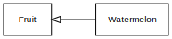
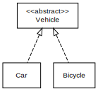
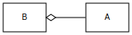
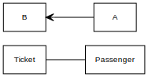
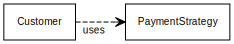
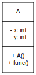

# UML类图

这篇文章介绍如何画UML类图（class diagram），用来表示类之间的包含、继承关系等。

## UML

UML（Unified Modeling Language，统一**建模语言**），是一种通用的、与开发相关的建模语言，用于软件开发领域，意在提供一种使系统设计可视化的标准方式。

> **建模语言**（[Modeling language - Wikipedia](https://en.wikipedia.org/wiki/Modeling_language)）：任何一种**通过**一套相互协调的规则而定义出来的一种**结构**，来**表达信息**、知识或者系统的人造语言。这些规则用来解释结构中组成元素的含义。

关于UML的更多介绍，请阅读维基百科：[Unified Modeling Language - Wikipedia](https://en.wikipedia.org/wiki/Unified_Modeling_Language)

[UML - Class Diagram - Tutorialspoint](https://www.tutorialspoint.com/uml/uml_class_diagram.htm)

简单地说，就是用来描述一个系统的设计的语言，这个语言规定的有一些约定好的“语法”和符号，要用这些规定好的方式来表述信息。

就好比，要讲述我们对于一个系统（或者流程）的设计，我们可以用自己方式的涂鸦来呈现给别人，但是别人有可能看不懂，而使用UML规范画图，就不容易产生误解，这两者就像是方言和普通话的差别。

UML中有很多种图表，简单的来说可以分成两类，一些用来表示表示如结构组成之类的信息（*structural* information）；另一类表示广义上的行为（general types of *behavior*），其中又包括几种表示不同层面下交互（*interaction*）的图标。

| 类型                          | 介绍                                                         |
| :---------------------------- | ------------------------------------------------------------ |
| 结构图（Structure Diagram）   | 组织结构图表示一个系统的静态层面，它强调的是一个系统在建模时所必须要**展现**出的事物。因此，其被广泛用来说明软件系统的软件架构。 |
| 行为图（Behavior Diagram）    | 行为图表现系统的动态层面。它强调的是在建模时系统必须要**发生**的事情。因此，一般用来说明软件系统的功能。 |
| 交互图（Interaction Diagram） | 作为行为图的一个自己，交互图强调的是在建模过程中系统的控制流程，以及各组件之间的信息交互。 |

## UML 类图

👉[看懂UML类图和时序图 — Graphic Design Patterns (design-patterns.readthedocs.io)](https://design-patterns.readthedocs.io/zh_CN/latest/read_uml.html#id3)（GitHub仓库地址：[me115/design_patterns: 图说设计模式](https://github.com/me115/design_patterns)）

### 类图

为了应付日常生活工作的要求，我们需要了解类之间的关系在UML中是如何表示的。

下面是我从上面网站搬过来的示例图：

- 车的类图结构为`<<abstract>>`，表示车是一个抽象类；
- 它有两个继承类：小汽车和自行车；它们之间的关系为**实现**关系，使用**带空心箭头的虚线**表示；
- 小汽车为与SUV之间也是继承关系，它们之间的关系为**泛化**关系，使用**带空心箭头的实线**表示；
- 学生与班级之间是**聚合**关系，使用**带空心菱形的实线**表示；
- 小汽车与发动机之间是**组合**关系，使用**带实心菱形的实线**表示；
- 学生与身份证之间为**关联**关系，使用**一根实线**表示；
- 学生上学需要用到自行车，与自行车是一种**依赖**关系，使用**带箭头的虚线**表示；

| 类之间的关系                    | 说明                                                         | 图例                                                         |
| ------------------------------- | ------------------------------------------------------------ | ------------------------------------------------------------ |
| 泛化关系（generalization）      | 也可以说是一般的**继承**关系，即为"is-a"的关系——两个对象之间的关系可以用“A是一个B”这样的描述表示。比如，西瓜是水果。 |  |
| 实现关系（Interface Inheritance | 也可以说是“接口继承（Interface Inheritance）”，即从抽象类继承而来。比如，“车”是一个抽象概念，只有像“汽车”、“自行车”才能生成具体的对象。 |  |
| 聚合关系（aggregation）         | 表示整体由部分构成的语义：例如一个部门由多个员工组成。与组合关系不同的是，整体和部分不是强依赖的，即使整体不存在了，部分仍然存在：例如， 部门撤销了，人员不会消失，他们依然存在。如图表示A聚合到B上，或者说B由A组成。 |  |
| 组合/强聚合 关系(composition)   | 与聚合关系一样，组合关系同样表示整体由部分构成的语义。但组合关系是一种强依赖的特殊聚合关系，如果整体不存在了，则部分也不存在了：例如，公司不存在了，部门也将不存在了。如图表示A组成B，或者B由A组成。 |  |
| 关联关系(association)           | 关联关系是用一条直线表示的；它描述不同类的对象之间的结构关系；它是一种静态关系， 通常与运行状态无关，一般由常识等因素决定的；它一般用来定义对象之间静态的、天然的结构； 所以，关联关系是一种“强关联”的关系；关联关系默认不强调方向，表示对象间相互知道；如果特别强调方向，如下图，表示A知道B，但B不知道A。 |  |
| 依赖关系(dependency)            | 描述一个对象在运行期间会用到另一个对象的关系。与关联关系不同的是，它是一种临时性的关系，通常在运行期间产生，并且随着运行时的变化，依赖关系也可能发生变化。如下图表示A依赖于B。 |  |

### 时序图

暂不展开介绍

## 如何画图？

有很多软件可以使用。

### 直观绘图法

有一款免费的开源软件 [Diagram Software and Flowchart Maker (diagrams.net)](https://www.diagrams.net/)，在线就可以使用，也可以下载客户端，而且还有针对VS Code等IDE的集成等等，很强大。

GitHub仓库地址：[jgraph/drawio: Source to app.diagrams.net (github.com)](https://github.com/jgraph/drawio)

### 代码绘图法

相关链接：[Text to UML and other "diagrams as code" tools - Fastest way to create your models (modeling-languages.com)](https://modeling-languages.com/text-uml-tools-complete-list/)

#### yUML

复杂的图还是推荐用上边的工具来画，简单的小图可以用yUML，十分推荐。

有在线网站可以解析渲染yUML，也有VS Code集成。

在线网站：[Create UML diagrams online in seconds, no special tools needed. (**yuml.me**)](https://yuml.me/)

VS Code插件自行在商店搜寻“yUML”安装。

关于yUML的**语法**，VS Code插件的作者有一个整理：[Home · jaime-olivares/yuml-diagram Wiki (github.com)](https://github.com/jaime-olivares/yuml-diagram/wiki)

yUML不仅可以画类图，其他的活动图、行为图等等也是可以的 。这里只介绍画类图：

| 类型                              | 代码                                                         |                             示例                             |
| --------------------------------- | ------------------------------------------------------------ | :----------------------------------------------------------: |
| 类                                | `[A]`                                                        |                                                              |
| 带详细信息的类                    | `[A|- x: int;- y: int|+ A();+ func()]`（不同区域用竖线隔开） |  |
| 单向箭头                          | `[A]->[B]`                                                   |                                                              |
| 双向箭头                          | `[A]<->[B]`                                                  |                                                              |
| 连线                              | `[A]-[B]`                                                    |                                                              |
| 聚合（Aggregation）               | `[A]+-[B]`或者`[A]<>-[B]`                                    |  |
| 组合（Composition）               | `[A]++-[B]`                                                  |  |
| 继承（Inheritance）               | `[Fruit]^[Watermelon]`                                       |  |
| 接口继承（Interface Inheritance） | `[<<abstract>> Vehicle]^-.-[Car]`，`[<<abstract>> Vehicle]^-.-[Bicycle]` |  |
| 依赖（Dependencies）              | `[Customer]-.->[PaymentStrategy]`                            |  |

要使用集成在VS Code中的插件，还请参阅作者整理的Wiki。

#### PlantUML

PlantUML稍微复杂些，但有兴趣也可以了解一下。

教程链接：[Drawing a UML Diagram in the VS Code | by Joe T. Santhanavanich | Towards Data Science](https://towardsdatascience.com/drawing-a-uml-diagram-in-the-vs-code-53c2e67deffe)

教程中提到的PlantUML网站：[Open-source tool that uses simple textual descriptions to draw beautiful UML diagrams. (plantuml.com)](https://plantuml.com/en/)。这个网站也有[中文版](https://plantuml.com/zh/)，也可以点击页面上的语言按钮切换。