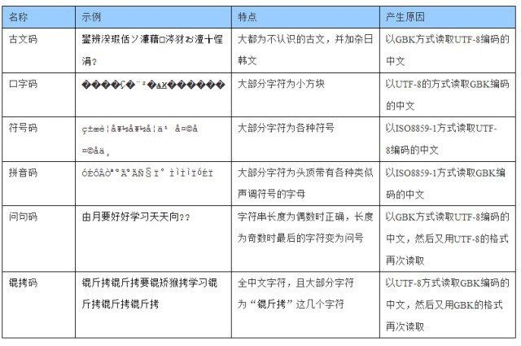

# 视觉/算法组 - 入门指南

说实话，目前本手册中提到的内容，本人也并不完全了解；引用的链接，也没有都看……期待与各位一起学习！

> *“…是故无贵无贱，无长无少，道之所存，师之所存也。…是故弟子不必不如师，师不必贤于弟子……”*
>
> —— 韩愈《师说》

感谢学长学姐以及 [@空忧居士](https://me.csdn.net/qq_45871272)、@Par 等的支持！

**本文档所有内容仅供参考！**

文档暂分为基础知识篇和专业知识篇。该文档为专业知识部分。

## 专业知识

### 1. 编程语言

#### 发展历史

LISP、BASIC等……

#### C语言

**语言发展史**

**环境配置**

编译器：clang、gcc、msvc、……

具体每个编译器的介绍暂不过多赘述。

参考链接：

> [MinGW、MinGW-w64 与TDM-GCC 应该如何选择？ - 知乎](https://www.zhihu.com/question/39952667)
>
> [如果仅考虑 Windows 平台，不用 msvc 而去用 gcc 的理由有哪些？ - 知乎](https://www.zhihu.com/question/41733001)
>
> [Qt用 MSVC和MinGW哪个编译器编译程序比较好？ - 知乎](https://www.zhihu.com/question/331375227)
>
> [怎么安装mingw离线包？ - 知乎](https://www.zhihu.com/question/313334589)
>
> [如何评价MSYS2以及未来发展方向如何？](https://www.zhihu.com/question/37025275)

**知识点 / 概念学习：**

- 编译、链接

- 数据类型、控制语句
- 头文件；多文件编程
- 模块化编程
- 宏定义（头文件保护、宏函数等）

> 在学习的时候经常会遇到编译器报错的情况，一定要**学会看错误信息**，不会就问，或者自己查，这样能加快解决问题的速度。

**如何进行编程练习？**

各种刷题网站？课本课后习题？

[首页 - 洛谷 | 计算机科学教育新生态 (luogu.com.cn)](https://www.luogu.com.cn/)

**参考书籍**：

《C Primer Plus》等……

> [如何看c primer plus这本书？ - 知乎 (zhihu.com)](https://www.zhihu.com/question/58611609)

**参考链接**：

[语言基础简介 - OI Wiki](https://oi-wiki.org/lang/)

#### C++

C++是C的升级，引入了很多新的概念和特性；它是向下兼容C语言的

**知识点 / 概念学习：**

类和对象

多态与继承

友元、异常

代码重用、泛型编程

STL 标准模板库

~~第三方库 Boost~~

线程和进程

智能指针

**参考书**：C++ Primer Plus、Effective C++

#### Python

> 这方面我还不了解，暂时放几个关键字在这里

环境配置：Python解释器、IDE

和人工智能、神经网络的关系：貌似机器学习人工智能啥的几乎都是拿python做的……

PyTorch：

> PyTorch是一个开源的Python机器学习库，基于Torch，底层由C++实现，应用于人工智能领域，如自然语言处理。——维基百科

#### 代码规范

阅读优秀的代码，可以学习到别人的良好的编程习惯或者编程思想，使自己进步。当然，还是要记得货比三家！

这里有一些常见的问题需要注意：

- **文件编码问题**

  常见的编码有GBK、GB2312、UTF等。

  有些时候打开文件或者应用程式遇到乱码错误很可能就是由于编码问题。

  视频🎞：[文字频频乱码，这背后是显卡的扭曲还是规则的沦丧？ - 哔哩哔哩](https://www.bilibili.com/video/BV1ai4y1x7Uz)

  > 别问，问就是Windows。比如简体中文是GBK，繁体中文使用Big5等等。

  在编码、写文件时，请使用UTF编码，它更为通用，使用范围更广泛。虽然一些Windows平台上的老旧的IDE比如Dev-C++等采用并且只支持GBK编码，但是请**不要将就**它们，计算机不是一门守旧的科学。

  > Windows的记事本貌似很智能，可以推断出文件的编码，如果接收到的文件打开是乱码时，可以用记事本打开并将内容复制出来，或以需要的编码保存。
  >
  > VSCode也能自动推断编码类型，但需要手动操作。

  **注意**：当以错误的编码打开文件时，如果再次保存，那么丢失的信息将无法恢复。所以请留意是否以正确的编码打开了文件。

  > 当在**简体中文**版的Windows上使用`gcc`编译链接UTF-8格式且含有中文的源代码生成可执行文件时，你可能会惊讶的发现窗口中输出了一堆乱码。这是由于`gcc`自动推断出文件的编码（UTF-8）并以UTF-8格式输出可执行文件，而这样编码的程序在简中版的Windows上执行时就会发生问题。这大概也是为什么Dev-C++只支持GBK编码的原因。
  >
  > 一个**妥协**举措是给`gcc`加上一个参数`-fexec-charset=GBK`，这样输出的可执行文件就能正常执行了。

  这里有一个表格，总结了常见乱码的原因：

  

  不过说一千道一万，**用英文写**代码、写注释，就不会有这些问题了……

  拓展阅读：[字符集编码 定长与变长 - 博客园 (cnblogs.com)](https://www.cnblogs.com/yelongsan/p/6290206.html)

  更多相关信息请自行查阅。

- 给自己的代码良好的**注释**

  写代码的时候记得添加一些注释。良好的注释可以**方便自己和别人**阅读和修改代码。

  通常，对于一个函数应该写明其具有的功能、函数各个参数的意义；对于变量要有其作用的介绍。这样性质的注释一般写在函数或变量的**声明**处附近。而对于函数的定义部分也最好有相应的解释，可以告诉读者某行或某段代码实现了什么事情、或者为什么这样写。

  > 很多编辑器、IDE可以识别到这些注释，并在鼠标悬停在它们的调用上时显示出函数的原型和注释，很是方便。

  函数、变量名本身也应该体现一定的意义。如果得当，那么代码则具有自述性(self-explaining)，而不必要额外再写注释了。（可以类比伪代码）

  > 起变量名在一定程度上也需要一定的英语考究，一些词虽然意思相近，但会用其中的一个而不是另一个。（为了让更多的人能看懂代码，不建议用拼音来命名……）

  另外，再次强调编码问题！不然自己辛辛苦苦写的注释可能就没了……

- 养成良好且规范的**变量 / 函数命名**方式和习惯

  **函数**、**变量名**主要有下划线法、驼峰法等，比如`find_first_of()`、`namedWindow()`等。

  **宏名**和**枚举名**（其实枚举就可以视作一种宏定义）一般采用全大写+下划线，比如`BGR2GRAY`、`MAX_LENGTH`、`BLUE`等。

  一般来说，函数、局部变量名、全局变量名、宏名等，应该采用**不同的命名法**以区分彼此。

  变量名也应具有一定的**意义**，比如`tmp`、`temp`一般表示临时变量，`i`、`j`、`k`等一般用作迭代，`cnt`一般用来计数。

- 注意代码编写时**缩进**问题

  注意代码的缩进，良好的缩进便于阅读代码的层次，也方便看出错误。而比如Python这种语言，如果缩进有问题，则直接无法执行。

  很多代码编辑工具有自动格式化的功能，可以帮助你轻松完成这件事情，可以自行了解如何使用这项功能。

  由于不同国家或个人的缩进习惯不一样，一级缩进（或者说一个Tab）可以是 2 / 4 / 8 个空格。因此**不要将空格(Space)和缩进(Tab)混用**，这样会使得显示出来的代码层次变得混乱，难以阅读。
  
- 关于**命名空间**

  首先了解命名空间是什么，此处略。

  慎用`using`指令：

  `using`指令可以帮大家省去如如`std::cin`、`std::endl`等之前的`std::`。这样用在小型程序里一般没有什么问题，但是在较大的项目中可能会出现重名现象。建议是少用或者不用`using`指令，这样也能让自己熟悉哪些东西是在哪些空间里。
  
  不过，也可以只将需要的几个标识符写上，比如常用的`using std::cin`、`using std::cout`、`using std::endl`。

### 2. 开发工具使用

了解动静态链接库、CMake、编译器原理、操作系统之类的基础知识将会非常有用

#### 基础知识

- bash、shell、命令行

  参考链接：[命令行界面 (CLI)、终端 (Terminal)、Shell、TTY，傻傻分不清楚？](https://printempw.github.io/the-difference-between-cli-terminal-shell-tty/)

- 库（比如 OpenCV、Boost、SDL）

- 平台（比如 Windows 、Linux、Mac）

- 未完待续……

> 计算机科学主要课程：**计算机组成**、**操作系统**、**数据结构**、**计算机网络**

#### Make、CMake

我不太会讲……还是看别人写的吧：

感觉这个写的挺好👍基本上我能想到要讲的都在里边了：[Make 命令教程 - 阮一峰的网络日志 (ruanyifeng.com)](http://www.ruanyifeng.com/blog/2015/02/make.html) 

这个也可以看看：[make makefile cmake qmake都是什么，有什么区别？ - 知乎 (zhihu.com)](https://www.zhihu.com/question/27455963)

**参考书籍**：

《CMake Practice》

《程序员的自我修养——链接、装载与库》俞甲子

#### IDE（集成开发环境）

[如何评价 JetBrains 的新 C/C++ IDE CLion？](https://www.zhihu.com/question/25259569)

Visual Studio

VSCode * 

JetBrains - CLion

PyCharm

#### GitHub使用

##### git

[Git 教程 | 菜鸟教程 (runoob.com)](https://www.runoob.com/git/git-tutorial.html)

[血泪教训之请不要再轻视Git —— 我在工作中是如何使用 Git 的 - 知乎 (zhihu.com)](https://zhuanlan.zhihu.com/p/250493093)

##### GitHub

概念了解

- commit 

  >  碎碎念：记得写`.gitignore` 文件，别把`*.o`， `*.exe`，`*.out`等文件传上去了……

- pull request (PR)

- push origin

- fork & star

- 静态页托管

使用的话有官方文档帮助；也可在搜索引擎上查找教程等

参考链接：

[如何实现Github markdown 目录/页内跳转？](https://www.zhihu.com/question/58630229)

##### gist

有点像一个云剪贴板，可以把代码片或者小型文档传上去。方便之处在于可以方便分享，随时修改（浏览器就行），还能记录迭代过程。

这里有篇博客和一个知乎问题，写的很好，推荐看一下

[Gist使用经验 - thinkam - 开发者的网上家园 (cnblogs.com)](https://www.cnblogs.com/thinkam/p/10922920.html)

[如何看待 Github Gist 这个服务，怎样更好的利用？ - 知乎 (zhihu.com)](https://www.zhihu.com/question/21343711/answer/201349136)

### 3. 环境配置

#### 虚拟机

虚拟机的话，有免费的Oracle VirtualBox，但这个貌似会和Win冲突

Hyper-V的话有一个硬伤，就是不能访问USB外设

体验好的话，还是用**VMware Workstation**，

> 这里也有下好的，可以来拷（不用花钱买流量了），对应版本的激活码也有。当然有能力还是支持正版啊！！

**参考链接**：

[喜大普奔！Hyper-V 和 VMWare 终于可以无缝共存、同时运行了！ - 简书 (jianshu.com)](https://www.jianshu.com/p/c02f776a65cd)

#### Linux基础

Linux历史

什么是Linux发行版

这里有个链接里面讲到了一些知识，可以**参考**一下：[第0章 咱们先来谈谈学习方法和红帽系统。 | 《Linux就该这么学》 (linuxprobe.com)](https://www.linuxprobe.com/chapter-00.html)

Linux使用

- 从源码安装 Build from source
- 包管理器

安装 Ubuntu

https://cn.ubuntu.com/

Ubuntu的中国站，可以在上边下载最新的Ubuntu镜像，还有BT下载可选（当然如果不想浪费钱去买流量，我这边已经下好，直接拷贝就可）

#### OpenCV 安装

OpenCV 介绍： [OpenCV教程：超详细的OpenCV入门教程，值得收藏！- C语言中文网](http://c.biancheng.net/opencv/)

> 也许读者可以先跳去OpenCV的部分学习OpenCV？

安装方法：

- 下载对应平台编译好的版本
- 通过包管理器安装
- 下载源码，自己build并安装

> 目前OpenCV已经推出4.4.0版本，建议大家尽量挑选3.4或之后的版本进行学习，因为很多算法和实现只在更新的版本中集成。
>
> 如果用包管理器装的话，应该直接就是4.x了
>
> 一定要用3的话，也建议3.4.1，不要太旧，旧版的会少集成些功能

初学的话其实也暂时不用经历从源码编译的过程

安装的话，Win的话去下载编译好的版本；Linux或者msys2这些都能直接安装，就好比在手机商店里面下载应用的感觉

学OpenCV时如果书上讲的不明白，可以去官方文档查（或者直接看它就够了？），貌似是[docs.opencv.org](docs.opencv.org)，或者直接搜索引擎搜索，比如像`cv::Mat`，就能看到想要的信息。官方文档下边都有配很棒的代码。

#### 使用 OpenCV

目前尝试过的方案总结：

| 平台    | 工具                  | 推荐性                                                       |
| ------- | :-------------------- | ------------------------------------------------------------ |
| Ubuntu  | VSCode + CMake        | 目前只使用过Ubuntu这一Linux发行版。比较推荐使用该方案，可以安装虚拟机，这样和主机之间传文件较方便；也可以装双系统，或者直接用Linux作主力系统。同时，项目未来运行环境也在Ubuntu，相当于提前上手适应；使用Linux系统也对未来的学习有一定帮助。 |
| Windows | CLion + CMake + msys2 | CLion是一个很好用的跨平台IDE，使用CMake实现跨平台构建；但是该IDE较占内存，对设备有一定要求。 |
| Windows | Visual Studio         | Visual Studio是一个成熟的IDE，可惜过于庞大，且代码补全功能不如VSCode |
| Windows | VSCode + msys2        | 对电脑配置要求较低，可以流畅的写代码。但是目前尚不清楚如何更方便的编译链接甚至构建一个项目。 |
| Mac     | VSCode + CMake        | 暂时不清楚可行性，如果有同学使用Mac可以一起进行探索。        |
| ...     | ...                   | 更多方案等待补充                                             |

推荐采用Ubuntu的有个小原因是可以自动找到包含目录，省心；在Win上使用msys2也有类似的效果，然后可以使用CLion或者VSCode。但如果是使用Visual Studio则可能需要手动为每个项目进行配置。

VSCode 是一个跨平台且免费的代码编辑器，可以装很多插件拓展其功能。可以说，不管在哪个平台上，VSCode都是非常厉害好用的。不过使用时要记得清理缓存，默认的上限是5GB，可以修改。

CLion 是一个跨平台的IDE，社区版免费；同时提供学生优惠，即用edu邮箱认证后可以免费使用高级版，同时也包括他家的PyCharm等产品。

Visual Studio的话，现如今社区版是免费的，商业版本需要收费。Visual Studio在使用过程中也会在项目文件夹下产生很大的缓存，使用时需要注意。

现代IDE基本都有**代码补全**、**语法检查**等功能。为什么强调这些功能呢？比如代码补全功能不需要编程者记录确切的函数名，只需要几次击键就可以联想出函数名，可以提高编程效率，同时也能降低错误率。而语法检查则能让编程者及时发现错误，同样能够提高效率。

### 4. 图像处理

#### 基础知识

比如计算机视觉是什么、图像的存储、处理等

偶然看到一些文章，觉得写的还可以，贴在这儿：

[AI产品经理如何实践计算机视觉项目 - 知乎 (zhihu.com)](https://zhuanlan.zhihu.com/p/30894935)

[人脸识别 | AI产品经理需要了解的CV通识（二） - 知乎 (zhihu.com)](https://zhuanlan.zhihu.com/p/32726495)

[多目标跟踪 | AI产品经理需要了解的CV通识（三） - 知乎 (zhihu.com)](https://zhuanlan.zhihu.com/p/32941534)

**参考书目**：《数字图像处理》

#### OpenCV学习

官方文档，书籍：如《OpenCV入门》啥的、实战/实践作业（或者说PBL？）

一个知乎链接：[几乎无C/C++基础的前提下，如何去学习OpenCV？ - 朝闻道的回答 - 知乎](https://www.zhihu.com/question/55953909/answer/300017966)

看到一本OpenCV官方出的书籍，挺好的：[学习OpenCV（中文版） (豆瓣) (douban.com)](https://book.douban.com/subject/4033320/) 。不过直接看这本书可能会比较生硬，可以粗略浏览，用作词典般的查阅；

有一个知乎上的链接：[如何从入门开始学习OpenCV？ - 知乎 (zhihu.com)](https://www.zhihu.com/question/19628117)

> 从里面摘出来几个回答（或者还是直接点到问题里面看吧）
>
> - 有个回答里提到的一本书，貌似是开源的，能下到PDF，也能在github上看：[mbeyeler/opencv-machine-learning: M. Beyeler (2017). Machine Learning for OpenCV: Intelligent image processing with Python. (github.com)](https://github.com/mbeyeler/opencv-machine-learning)
>
> - [nipan的回答 - 知乎](https://www.zhihu.com/question/19628117/answer/35120632)
>
> - [Self-contained的回答 - 知乎](https://www.zhihu.com/question/19628117/answer/155459651)

又一个知乎上的链接：

[学习OpenCV的建议？ - 知乎 (zhihu.com)](https://www.zhihu.com/question/26881367/answer/815156603)

### 5. 机器学习、神经网络

[有哪些可以自学机器学习、深度学习、人工智能的网站？ - 知乎 (zhihu.com)](https://www.zhihu.com/question/375537442/answer/1339829059)

> 根据前任组长建议，不要轻易尝试神经网络……
>
> 但是我觉得还是要了解一下吧……
>
> 但我也不是很了解，列几个关键词在这，以后补充……

Tensorflow

> TensorFlow是一个开源软件库，用于各种感知和语言理解任务的机器学习。

YOLO

[目标检测|YOLO原理与实现 - 知乎](https://zhuanlan.zhihu.com/p/32525231)

darknet

### 6. 电控相关

电控方面的知识也要学习，不然未来不好对接；

比如串口通信相关的知识

#### ROS

> ROS (Robot Operating System, 机器人操作系统) 提供一系列程序库和工具以帮助软件开发者创建机器人应用软件。它提供了硬件抽象、设备驱动、库函数、可视化、消息传递和软件包管理等诸多功能。ROS遵守BSD开源许可协议。

### 7. 工程设计、管理

Make，CMake

GUI设计：MFC、Qt

源代码阅读，学习他校/他人 `=>` 了解他人进度情况、学习代码规范、提升自己码力

**参考链接**：

[RoboMaster 开源材料（持续更新）](https://bbs.robomaster.com/forum.php?mod=viewthread&tid=6979&page=1)

文档留存、代际传承

代码注释：方便阅读和修改

代码托管平台：GitHub、Gitee……

从RM论坛上跳转过来的：

[技术干货｜机器人装甲块的视觉识别是如何实现的？「上」 - 知乎 (zhihu.com)](https://zhuanlan.zhihu.com/p/55444151)

[技术干货｜机器人装甲块的视觉识别是如何实现的？「下」 - 知乎 (zhihu.com)](https://zhuanlan.zhihu.com/p/55445217)
