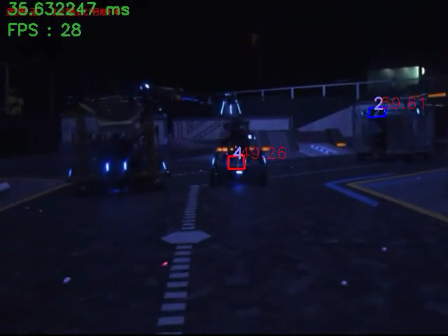

# 视觉组招新推送

修改日期：2020/10/11

## 简介

**视觉组**，因主要负责让机器人**看到**周围的环境而得名；而且不仅要让机器人看到身边的的事物，更重要的是要让它们对其进行一定的**思考**并做出**判断**。

视觉组也被称作**算法组**，因其不止负责计算机视觉方面的事务，也负责开发其他各流程中的算法。或者也可以说，视觉本身就是一套算法。

## 什么是计算机视觉？

|              |  图像（*输出*）|  知识（*输出*）|
|  :--------:  |  :----------: | :------------:|
| 图像（*输入*）|  数字图像处理  | **计算机视觉** |
| 知识（*输入*）|  计算机图形学  |    人工智能    |

**计算机视觉**（Computer vision）是一门研究如何使机器“看”的科学，更进一步的说，就是指用摄影机和计算机代替人眼对目标进行识别、跟踪和测量等机器视觉，并进一步做图像处理，用计算机处理成为更适合人眼观察或传送给仪器检测的图像。

\* *将视频图像拆分成R、G、B三通道*（图片源来自：电影 *Megamind*）

## 视觉组具体做什么？

\* *图为识别出图中蓝方的装甲板位置以及数字*

视觉算法主要用在机器人的自动或者半自动射击（简称“**自瞄**”）、**能量机关**的识别和触发上。其中自瞄包括了装甲板的**识别**和**追踪**甚至预判，还有**测距**以及弹道补偿等。看起来简单，实则包含了很多东西。

\* *图：“终极”目标跟踪*

除此之外，”视觉“还可以让机器人判断攻击目标的“小陀螺”模式（即底盘不断旋转以降低被击中的概率），并发送相应的数据控制射击。

视觉组可能还会负责机器人之间的**通信**与**协作**、自定义操作界面的设计等，可以说能发展的方向非常多。

总之，视觉/算法组的目的是让机器人**更加智能**、让操作手更加轻松。

## 视觉怎么学习？

学长给大家准备了入门指南，目前可以在 [github.com/tsagaanbar/RM-CV](github.com/tsagaanbar/RM-CV) 处查看。

视觉组目前的代码采用C++编写，需要大家了解面向对象的编程思想与技术、C++语言的特性。代码主要调用OpenCV库里面的方法。OpenCV是一个跨平台的计算机视觉库，可以在商业和研究领域中免费使用。可以登录OpenCV的官方文档网站查看介绍。

不用担心，这些内容在入门指南以及之后的培训中都会讲到。

## 来视觉组能收获到什么？

图像处理，工程设计和管理，可能还会有机器学习人工智能方面的研究。

## Q&A

Q：视觉组听起来好难啊，我能参加吗？

A：CV（Computer Vision，计算机视觉）听起来是挺复杂的，但其实也并非如登天，遇到难题大家会一同协作商讨解决方案，而且很多功能都是借用现有的算法和解决方案。当然，**创新**是非常重要的，我们鼓励有自己的想法，以及将其付之实现！

Q：是不是只有计算机专业才最适合加入视觉组？

A：并不是。视觉组，或者说整个机器人战队，对队员的所学专业都没有要求，只要有兴趣和热爱，我们都欢迎你来！而且队员在视觉组的所学一般都能够和自己所学的专业结合起来，有很大的发展潜力。

## 结语

其实我们研究的内容并不高深，学长学姐也不是大神学霸。但是我们期待和大家一起做自己热爱的事情、做有趣的事情

**视觉组欢迎你的加入！**

